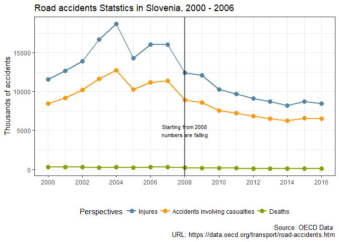

# Why has number of car casualties in Slovenia fallen in last years?
Elvira Nassirova  
28 Jan 2018  

As we can see from the graph below there is a significant fall in a number of car accidents starting from 2008.

<!-- -->

The first thing we are going to consult is [Slovenian Police reports](https://www.policija.si/eng/index.php/statistics). According to them, in 2008 there was an introduction of harsher penalties through the amended Road Safety Act. Indeed, a lot less violations were conducted in 2008, mainly due to the Road Traffic Safety Act.

Table: Violations detected during road traffic controls, 2006 - 2009

Regulations                                   2006      2007      2008      2009
----------------------------------------  --------  --------  --------  --------
Road Traffic Safety Act                    496 560   492 786   464 081   462 426
Act on Working Time and Compulsory Rest      4 449     4 327     4 837     4 194
Other regulations                            1 081       438     2 813     2 269
Total                                      502 090   497 551   471 731   468 889

The second interesting thing is that starting from 2010 there is a big change in net migration in Slovenia mostly due to fall of immigrants from Bosnia-Herzegovina, Serbia and Macedonia. In addition, a decrease in a number of accidents from 2009 to 2010 was seen in Slovenia (see the first graph).

<!-- -->

According to the [World Health Organization report](http://www.who.int/violence_injury_prevention/road_safety_status/2015/GSRRS2015_data/en/) estimated road traffic death rate per 100 000 population in these countries is higher (from 7.7 in Serbia to 17.7 in Bosnia-Herzegovina) than in Slovenia (6.4). If we build a scatter plot for a total number of immigrants from the indicated countries and a total number of car accidents in Slovenia, we can see correlation. 

<!-- -->

Overall, we may conclude there are at least **two reasons**:

* New Road Safety Act
* Decreased number of immigrants
